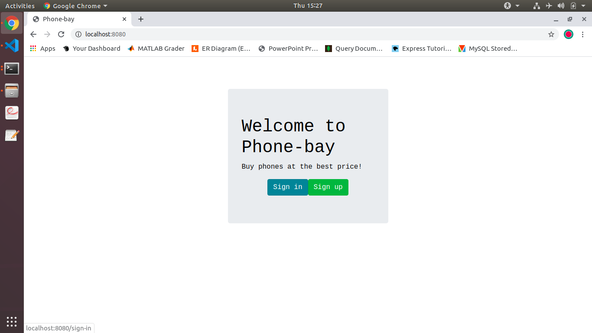
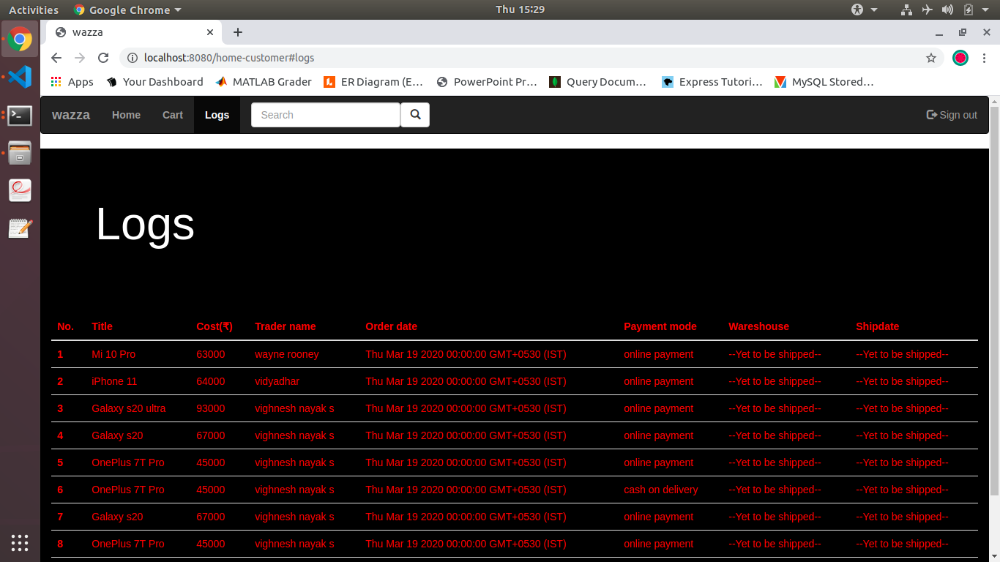
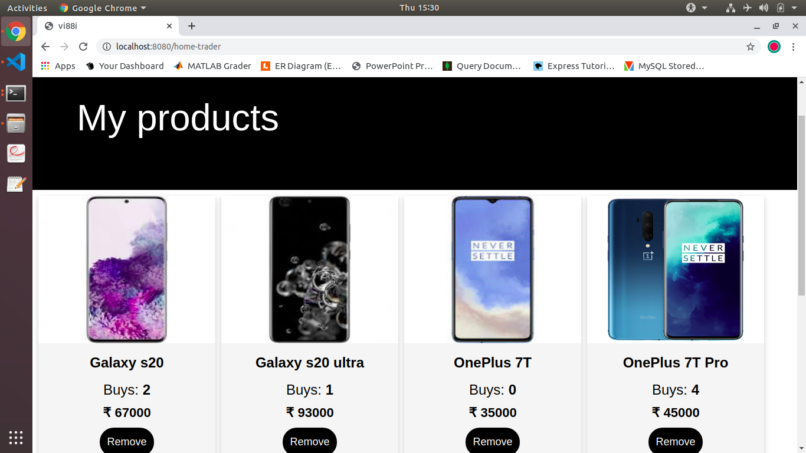

# phone-bay

<strong>Install node js and npm</strong>
```console
user@machine:~$ sudo apt update
user@machine:~$ sudo apt install nodejs
user@machine:~$ sudo apt install npm
```

<strong>Setup mysql server, and set root password</strong>
```console
user@machine:~$ sudo apt-get install mysql-server
user@machine:~$ sudo mysql_secure_installation
```

<strong>Clone this repository into your home directory</strong>
```console
user@machine:~$ git clone https://github.com/vi88i/phone-bay.git
```

<strong>Run setup_SQL.sh in sql folder, this will setup database, all tables, TSQL & PL/SQL</strong>
```console
user@machine:~$ cd phone-bay/sql
user@machine:~$ chmod +x setup_SQL.sh 
user@machine:~$ ./setup_SQL.sh
```

<strong>Create minimum of 1 customer and 3 trader accounts</strong>
```console
user@machine:~$ cd phone-bay
user@machine:~$ node server.js 
```
<strong>In web browser go to ' localhost:8080', use sign-up option to create accounts.</strong>

<strong>Run populate.sh in sql folder, this will populate product table with 20 rows for product and 5 rows for warehouse</strong>
```console
user@machine:~$ cd phone-bay/sql
user@machine:~$ chmod +x populate.sh 
user@machine:~$ ./populate.sh
```

<strong>Done!</strong>

<strong>In web browser go to 'localhost:8080' after executing the following code, and start playing with it :) </strong>
```console
user@machine:~$ cd phone-bay
user@machine:~$ node server.js 
```

<strong>Few screenshots ... </strong>
Index page
<br>
Logs page
<br>
Trader home page
<br>

Collaborators:
  * Vishruth Kumar 
  * Varsha Nair 
  * Shamanth R Nayak 

<i>Sorry for bad front-end :)</i>


